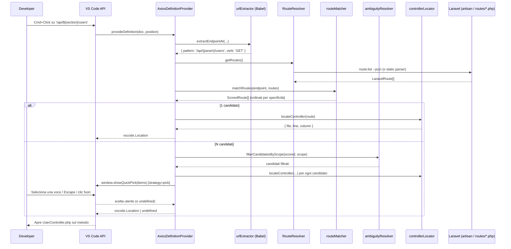
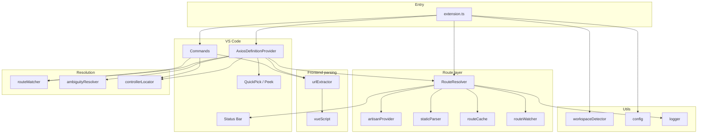

# Laravel-Vue Navigator — Presentazione tecnica per il team

Documento interno che descrive **come è stato progettato e implementato** l’estensione VS Code/Cursor **Laravel-Vue Navigator**: obiettivo, architettura, flusso dati end-to-end, decisioni di design e limiti noti.

**Versione estensione:** `0.1.0`  
**Stack:** TypeScript, VS Code Extension API, Babel Parser, php-parser (fallback), esbuild (bundle), Vitest (unit test)

> **Nota di revisione:** questa versione del documento include la pipeline di **gestione delle ambiguità** introdotta dopo la prima v0.1.0: quando l’URL axios contiene un’espressione runtime (`${...}`) e più rotte Laravel possono matchare, l’estensione mostra un `QuickPick` non invasivo invece di scegliere silenziosamente. Le sezioni 5, 8, 9 (nuova), 10.2, 12, 13, 15 e 17 sono state aggiornate di conseguenza.

---

## 1. Problema e obiettivo

Nei monorepo **Laravel (API/backend) + Vue (frontend)** il collegamento tra una chiamata HTTP nel frontend e il controller PHP non è visibile all’IDE: il “Go to Definition” standard non attraversa il confine linguaggio/progetto.

L’estensione implementa un **`DefinitionProvider`** VS Code: quando l’utente fa **Cmd+Click** (macOS) o **Ctrl+Click** su un URL dentro una chiamata `axios` (o wrapper equivalente) in un file `.vue`, `.ts` o `.js`, l’editor apre il file del **controller Laravel** posizionandosi sulla **firma del metodo** che gestisce quella route.

Non esegue il codice dell’app, non avvia server, non analizza il runtime: è un **navigatore statico** basato su AST JavaScript/TypeScript, elenco route Laravel e risoluzione file via PSR-4.

---

## 2. Vista d’insieme (pipeline)



In sintesi: **estrazione endpoint → cache route → match URI/verb (tutti i candidati) → eventuale disambiguazione UI → risoluzione file PHP → regex sul metodo**.

---

## 3. Struttura del repository

```
src/
├── extension.ts                 # Entry point: activate, wiring, comandi
├── providers/
│   └── axiosDefinitionProvider.ts   # Implementa vscode.DefinitionProvider
├── services/
│   ├── axiosParser/
│   │   ├── urlExtractor.ts      # Babel AST: trova axios.* al cursore
│   │   └── vueScript.ts         # Estrae <script> dai .vue
│   ├── routeResolver/
│   │   ├── index.ts             # RouteResolver (orchestrazione cache + refresh)
│   │   ├── artisanProvider.ts   # spawn php artisan route:list --json
│   │   ├── staticParser.ts      # Parser PHP delle routes (fallback)
│   │   ├── routeCache.ts        # Cache in-memory + disco
│   │   └── routeWatcher.ts      # File watcher con debounce
│   ├── routeMatcher.ts          # Confronto pattern client vs URI Laravel (matchRoute + matchRoutes)
│   ├── ambiguityResolver.ts     # Filtri scope + formattazione voci QuickPick (logica pura)
│   └── controllerLocator.ts     # PSR-4 + ricerca riga del metodo
├── models/
│   └── route.ts                 # Tipi condivisi (LaravelRoute, ExtractedEndpoint, …)
└── utils/
    ├── config.ts                # Lettura settings VS Code
    ├── workspaceDetector.ts     # Auto-detect monorepo
    ├── debounce.ts
    └── logger.ts                # Output channel "Laravel-Vue Navigator"
```

Il bundle pubblicato è `dist/extension.js` (esbuild, target Node per l’Extension Host).

---

## 4. Ciclo di vita dell’estensione (`extension.ts`)

### 4.1 Eventi di attivazione

In `package.json` l’estensione si attiva quando:

- si apre un file `vue`, `typescript`, `javascript`, `typescriptreact`, `javascriptreact`, **oppure**
- il workspace contiene un file `**/artisan`.

### 4.2 `activate(context)`

1. **Workspace root** — Se non c’è una cartella workspace aperta, l’estensione resta idle (log su output channel).
2. **Rilevamento percorsi** — `detectPaths()` cerca la root Laravel (`artisan`) e opzionalmente il frontend ( `package.json` con dipendenza `vue` / `nuxt` / `@vue/runtime-core`), fino a **profondità 3**, ignorando `node_modules`, `vendor`, ecc.
3. Se **non** trova `artisan`, l’estensione non registra provider (l’utente deve impostare `laravelVueNavigator.laravelPath`).
4. **`RouteResolver`** — Avviato con opzioni da config; fa un `refresh(true)` iniziale; viene aggiunto a `context.subscriptions` per il dispose.
5. **`AxiosDefinitionProvider`** — Registrato con `vscode.languages.registerDefinitionProvider` per i linguaggi supportati (solo schema `file:`).
6. **Comandi:**
   - `laravelVueNavigator.refreshRoutes` — refresh manuale + invalidazione cache Composer.
   - `laravelVueNavigator.showRouteForEndpoint` — debug: mostra in notifica la route matchata senza aprire il file.
7. **`onConfigChange`** — Se cambiano i settings della sezione `laravelVueNavigator`, ricalcola path, aggiorna opzioni del resolver e rifà refresh.

### 4.3 `deactivate()`

Chiama `resolver.dispose()` (watcher + status bar).

---

## 5. Flusso “Go to Definition” (cuore del prodotto)

Implementato in `AxiosDefinitionProvider.provideDefinition()`:

| Step | Modulo | Input | Output |
|------|--------|-------|--------|
| 1 | `extractEndpointAt` | sorgente file, lingua, posizione cursore | `{ pattern: string, verb?: HttpMethod }` o `undefined` |
| 2 | `RouteResolver.getRoutes()` | — | `LaravelRoute[]` (da cache o refresh) |
| 3 | `matchRoutes` | endpoint + routes + `apiBaseUrl` | `ScoredRoute[]` ordinati per specificità decrescente |
| 4a (1 match) | `locateController` | route + `laravelRoot` | `{ file, line, column }` → `Location` |
| 4b (N match) | `filterCandidatesByScope` + `locateController` | scored + `ambiguityScope` | Insieme dei candidati eleggibili (con file PHP risolto) |
| 5 (N match) | strategia configurata | candidati | `Location` (`pick`/`first`) o `LocationLink[]` (`peek`) |
| 6 | VS Code | `Location` / `LocationLink[]` | Apre il file PHP alla riga del `function`, o mostra il Peek panel |

Se uno step fallisce, il provider restituisce `undefined` e VS Code non naviga (comportamento standard).

**Cancellation:** dopo ogni `await`, si controlla `token.isCancellationRequested` per non sprecare lavoro se l’utente ha già spostato il cursore. La stessa cancellazione viene propagata al `QuickPick` tramite un `CancellationTokenSource` interno, così se VS Code cancella l’operazione (cambio editor, nuovo Cmd+Click, ecc.) il popup si chiude automaticamente.

---

## 6. Estrazione dell’endpoint dal frontend (Babel)

**File:** `src/services/axiosParser/urlExtractor.ts`, `vueScript.ts`

### 6.1 File Vue

I `.vue` non sono parsati interamente: `findContainingScript()` individua il blocco `<script>` che contiene la riga del cursore (supporto `<script lang="ts">`), calcola **offset di riga/colonna** e passa solo il contenuto dello script a Babel.

### 6.2 Parsing AST

- Parser: `@babel/parser` con plugin `typescript` o JS, più `jsx` e `decorators-legacy`.
- `errorRecovery: true` — file parzialmente invalidi possono comunque dare un AST utile.
- Si attraversano le `CallExpression`; si seleziona quella che **contiene geometricamente** la posizione del cursore (`node.loc`).
- Il click deve cadere sull’**argomento URL** (primo argomento o proprietà `url` nell’oggetto opzioni), non sul nome `axios` o sul body della request.

### 6.3 Forme riconosciute

| Pattern nel codice | Esempio | `pattern` estratto | `verb` |
|--------------------|---------|-------------------|--------|
| Metodo HTTP su client | `axios.get('/api/users')` | `/api/users` | `GET` |
| Template literal | `` axios.post(`/users/${id}`) `` | `/users/{param}` | `POST` |
| Oggetto opzioni | `axios({ method: 'patch', url: '...' })` | URL da `url` | da `method` |
| Wrapper | `api.delete('/sessions')` | come sopra | `DELETE` |

**Client HTTP riconosciuti** (regex su identificatori): `axios`, `http`, `api`, `client`, `instance`, `$http`, `$api`, anche su catene tipo `this.$http` (parziale: `this` da solo non basta).

**Non supportato (volutamente):** URL in variabili o costanti (`const u = '/x'; axios.get(u)`), perché servirebbe un analisi di flusso dati.

### 6.4 Normalizzazione URL nel pattern

- Stringhe letterali → valore diretto.
- Template literals → segmenti statici + `{param}` per ogni `${...}`.
- Concatenazione con `+` tra stringhe letterali → concatenazione del pattern.
- Cast TypeScript (`as`, `!`) → unwrap sull’espressione interna.

---

## 7. Risoluzione delle route Laravel (`RouteResolver`)

**File:** `src/services/routeResolver/index.ts`

Responsabilità: mantenere un elenco aggiornato di `LaravelRoute`, gestire **cache**, **watcher**, **status bar** e strategia **stale-on-error**.

### 7.1 Modello dati `LaravelRoute`

```typescript
interface LaravelRoute {
  methods: HttpMethod[];      // es. ['GET','HEAD'] — HEAD spesso filtrato da artisan
  uri: string;                // es. '/api/users/{id}'
  name?: string;
  action: string;             // stringa completa da artisan
  controller?: string;        // FQCN, es. App\Http\Controllers\UserController
  controllerMethod?: string;  // es. show
  middleware?: string[];
}
```

### 7.2 Strategia ibrida: Artisan (primario) → Static parser (fallback) → Stale cache

```
useArtisan === true?
    ├─ SÌ → php artisan route:list --json
    │         ├─ OK → cache write (source: artisan)
    │         └─ ERRORE → fallback static parser
    └─ NO → solo static parser

static parser
    ├─ OK (routes.length > 0) → cache write (source: static)
    └─ ERRORE o 0 route → useStale()
            ├─ in-memory cache precedente
            ├─ oppure file .vscode/laravel-vue-navigator.cache.json (TTL ignorato)
            └─ altrimenti [] e status "no routes"
```

**Perché Artisan:** risolve route registrate a runtime (ServiceProvider, macro, `Route::group` complessi, middleware, prefix applicati da Laravel) — output uguale a quello che vede l’app.

**Perché static parser:** ambienti senza PHP, CI dell’IDE, o `artisan` che fallisce (syntax error temporaneo nel progetto).

### 7.3 `artisanProvider.ts`

- `spawn(phpBinary, ['artisan', 'route:list', '--json'], { cwd: laravelRoot })`
- Timeout default **15 secondi**; kill `SIGKILL` se scade.
- Parse JSON array; ogni voce mappata con `splitAction` su `Controller@method` o invokable senza `@`.
- `Closure` → route senza `controller` (il provider non navigherà).

### 7.4 `staticParser.ts`

- Libreria **`php-parser`** (AST PHP 8).
- File analizzati di default: `routes/api.php`, `web.php`, `console.php`, `channels.php`.
- Riconosce catene `Route::get(...)`, `Route::prefix()->middleware()->group(...)`, `Route::resource`, `Route::apiResource`, redirect, action array `[UserController::class, 'index']` e stringa `'App\Http\Controllers\UserController@show'`.
- **Limiti rispetto ad Artisan:** non esegue PHP; route definite solo in ServiceProvider custom o con logica condizionale complessa possono mancare.

### 7.5 Cache (`routeCache.ts`)

- Path: **`.vscode/laravel-vue-navigator.cache.json`** nella root del workspace.
- Payload versione `1`: `generatedAt`, `source`, `routes[]`.
- TTL configurabile (`routeCacheTtl`, default 3600s) — rete di sicurezza; in uso normale il **file watcher** invalida prima.
- Scrittura su disco best-effort: se fallisce, resta la copia in-memory.

### 7.6 File watcher (`routeWatcher.ts`)

Pattern osservati (relativi a `laravelRoot`):

- `routes/**/*.php`
- `app/Http/Controllers/**/*.php`
- `app/Providers/**/*.php`

Su create/change/delete → **debounce** (`refreshDebounceMs`, default 500ms) → `RouteResolver.refresh(true)`.

*Nota:* modifiche ai soli controller non cambiano l’URI, ma possono cambiare namespace/class name in alcuni refactor; il refresh è conservativo.

### 7.7 Status bar

Item a destra con stati: `ready` | `refreshing` | `N routes (artisan|static)` | `stale (N)` | `no routes`. Click → comando refresh.

---

## 8. Matching endpoint ↔ route (`routeMatcher.ts`)

### 8.1 Varianti di path

Da un `pattern` client (es. `/users/42/posts`) si generano candidati:

- path così com’è;
- con prefisso `apiBaseUrl` se configurato (es. `/api` + `/users` → `/api/users`);
- slash iniziale normalizzato.

### 8.2 Normalizzazione segmenti

- Rimozione query string (`?foo=bar`).
- Trailing slash rimosso (tranne root `/`).
- Segmenti `{id}`, `{param}` (da template JS) trattati come **wildcard** parametrici.

### 8.3 Confronto e specificità

Per ogni route Laravel, si normalizza `uri` allo stesso formato a segmenti e si verifica compatibilità letterale/param.

Score di specificità: segmenti letterali valgono **2**, parametri valgono **1** (preferisce `/users/{id}` rispetto a un catch-all `{any}`).

### 8.4 Verbo HTTP

Se `verb` è noto (da `axios.get`, ecc.), si filtrano route che non accettano quel metodo (`ANY` accetta tutto).

Se non c’è match con il verb, si riprova **senza filtro verb** (utile per `axios({ url, method })` malformati o edge case).

### 8.5 API esposta: `matchRoute` vs `matchRoutes`

Il modulo espone **due funzioni**:

| Funzione | Ritorna | Uso |
|----------|---------|-----|
| `matchRoute(endpoint, routes, opts)` | `LaravelRoute \| undefined` | Comodo per chiamate batch (es. comando “Show route for endpoint”). È un wrapper su `matchRoutes()[0]?.route`. |
| `matchRoutes(endpoint, routes, opts)` | `ScoredRoute[]` ordinato per `score` desc | Cuore del provider: serve a riconoscere e gestire ambiguità (più candidati). Deduplica per `LaravelRoute` quando più varianti normalizzate matchano la stessa rotta. |

Quando il pattern client contiene `{param}` (template literal) **e** più rotte Laravel hanno segmenti letterali compatibili con quella posizione, `matchRoutes` restituisce **tutti** i candidati, lasciando al provider la scelta dell’UI/strategia.

---

## 9. Disambiguazione (`ambiguityResolver.ts` + provider)

### 9.1 Perché esiste

Esempio reale:

```ts
let section = 'template';
axios.get(`/api/${section}/users`);
```

Il pattern estratto è `/api/{param}/users`. Se in Laravel esistono sia `GET /api/template/users` sia `GET /api/route_book/users`, entrambi hanno la stessa specificità (3 segmenti letterali in route → score 6) e **prima della v0.1.x il provider sceglieva la prima silenziosamente**. Comportamento ambiguo e dipendente dall’ordine di registrazione delle route.

### 9.2 Pipeline di disambiguazione

```
matchRoutes() → ScoredRoute[]
        │
        │  N == 0 → undefined (nessuna definizione)
        │  N == 1 → jump diretto
        │  N >  1 ↓
        ▼
filterCandidatesByScope(scored, ambiguityScope)
        ├─ 'topScoreOnly' → solo i candidati col top score (default)
        └─ 'allMatches'   → tutti i match, anche fallback meno specifici
        │
        │  Risolve i file PHP via locateController per ogni candidato
        │  (gli irrisolvibili vengono scartati)
        │
        ▼
ambiguityStrategy
        ├─ 'pick'  → vscode.window.showQuickPick(items)  [default]
        ├─ 'peek'  → return LocationLink[] (VS Code apre il Peek nativo)
        └─ 'first' → return Location del primo candidato (comportamento legacy)
```

### 9.3 Modulo `ambiguityResolver.ts`

Logica **pura** (zero dipendenze da `vscode`) → completamente unit-testata.

| API | Ruolo |
|-----|-------|
| `filterCandidatesByScope(scored, scope)` | Implementa la regola di scope (`topScoreOnly` mantiene solo lo strato col top score; `allMatches` lascia tutto). |
| `formatQuickPickEntry(candidate, laravelRoot)` | Costruisce `{ label, description, detail }` per un’unica voce del `QuickPick`: `label = "GET /api/template/users"`, `description = action FQCN`, `detail = path file PHP relativo alla root Laravel`. |

### 9.4 `QuickPick` (`pick`)

Implementato in `AxiosDefinitionProvider.promptUserToPick()`:

- `vscode.window.showQuickPick(items, options, cancelToken)`.
- `placeHolder`: `"Più rotte Laravel matchano questo endpoint — selezionane una (N)"`.
- `title`: `"Laravel-Vue Navigator: scegli la rotta"`.
- `matchOnDescription` e `matchOnDetail` abilitati (filter incrementale).
- `ignoreFocusOut: false` → il popup si chiude da solo su clic fuori, cambio editor, ecc.
- La `CancellationToken` del provider è collegata a una `CancellationTokenSource` locale per chiudere il `QuickPick` se VS Code cancella la richiesta di definizione.
- L’`await showQuickPick` ritorna nello stesso `provideDefinition`, quindi VS Code naviga *come se* avesse trovato una sola definizione: niente flicker, niente comandi separati.

### 9.5 `Peek` (`peek`)

In modalità `peek`, il provider ritorna direttamente l’array `LocationLink[]`: VS Code apre il proprio Peek panel inline. Pro: zero UI custom. Contro: il Peek mostra path file + snippet, **non** l’URI della route, quindi è meno informativo del `QuickPick` quando più rotte puntano allo stesso controller.

### 9.6 `First` (`first`)

Comportamento legacy: il primo candidato ordinato per score vince, senza prompt. Utile per chi preferisce non interrompere il flusso e si fida del best-match.

### 9.7 Logging

Quando rileva ambiguità il provider emette una riga sull’output channel:

```
[<timestamp>] Ambiguous endpoint '/api/{param}/users' (GET): 2 candidate routes -> strategy=pick
```

Utile per debugging in support su monorepo grandi.

---

## 10. Localizzazione del controller (`controllerLocator.ts`)

### 10.1 Da FQCN a file

1. Legge `composer.json` → mappe **PSR-4** (`autoload` + `autoload-dev`), con cache in-memory per workspace.
2. Prova prefix PSR-4 dal più lungo al più corto.
3. Fallback convenzione Laravel: `App\...` → `app/....php`.

### 10.2 Da metodo a riga/colonna

Lettura testuale del file PHP (non AST PHP per il metodo):

```regex
^\s*(public|protected|private)?\s*(static\s+)?function\s+<methodName>\s*\(
```

Prima occorrenza → `Position` per VS Code (colonna sul token `function`). Se il metodo non esiste, fallback riga 0.

`clearComposerCache()` viene chiamato su refresh manuale e cambio config, per riflettere modifiche a `composer.json`.

---

## 11. Monorepo e configurazione

### 11.1 Auto-detect (`workspaceDetector.ts`)

| Target | Marker | Profondità max |
|--------|--------|----------------|
| Laravel | file `artisan` | 3 livelli sotto workspace root |
| Frontend | `package.json` con `vue` / `nuxt` / `@vue/runtime-core` | 3 livelli |

Cartelle ignorate: `node_modules`, `vendor`, `.git`, `dist`, `build`, `storage`, `public`, ecc.

Il **frontend root** oggi è rilevato e loggato ma **non** limita dove funziona il DefinitionProvider: tutti i file `vue/ts/js` nel workspace con schema `file:` sono eleggibili.

### 11.2 Settings (`laravelVueNavigator.*`)

| Setting | Default | Ruolo |
|---------|---------|--------|
| `laravelPath` | `auto` | Path relativo alla root con `artisan`, o `auto` |
| `frontendPath` | `auto` | Informativo / futuro; `auto` |
| `apiBaseUrl` | `""` | Prefisso per URL axios senza `/` iniziale o senza prefisso API |
| `phpBinary` | `php` | Eseguibile PHP per artisan |
| `useArtisan` | `true` | `false` = solo static parser |
| `routeCacheTtl` | `3600` | TTL cache su disco (secondi) |
| `refreshDebounceMs` | `500` | Debounce watcher (ms) |
| `ambiguityStrategy` | `pick` | Reazione a >1 match: `pick` (QuickPick), `peek` (Peek nativo), `first` (best-match silenzioso) |
| `ambiguityScope` | `topScoreOnly` | Sottoinsieme da mostrare: `topScoreOnly` (solo pari-merito al top score) o `allMatches` (anche fallback meno specifici). Ignorato con `ambiguityStrategy: first` |

I valori delle due ultime config sono validati a runtime da `coerceEnum`: stringhe fuori enum vengono silenziosamente riportate al default per evitare regressioni se l’utente sbaglia il valore in `settings.json`.

---

## 12. Integrazione VS Code API (punti chiave)

| API | Uso |
|-----|-----|
| `languages.registerDefinitionProvider` | Cmd+Click → `provideDefinition` |
| `workspace.createFileSystemWatcher` | Refresh route su save |
| `window.createStatusBarItem` | Feedback stato cache |
| `commands.registerCommand` | Refresh e debug |
| `workspace.getConfiguration` | Settings |
| `window.createOutputChannel` | Log diagnostici |
| `window.showQuickPick` | Disambiguazione `ambiguityStrategy: pick` |
| `CancellationTokenSource` | Chiusura automatica del QuickPick su cancellazione VS Code |
| `LocationLink[]` ritornato da `provideDefinition` | Disambiguazione `ambiguityStrategy: peek` (Peek panel nativo) |

L’estensione **non** usa Language Server Protocol (LSP): è un provider leggero, senza processo separato.

---

## 13. Build, test e distribuzione

| Comando | Effetto |
|---------|---------|
| `npm run build` | esbuild → `dist/extension.js` |
| `npm run watch` | rebuild continuo per F5 |
| `npm test` | Vitest: urlExtractor, routeMatcher (+ `matchRoutes`), ambiguityResolver, staticParser, controllerLocator, debounce, artisan (mock) |
| `npm run package` | `.vsix` per installazione locale |
| F5 in repo | Extension Development Host |

I test unitari **non** avviano VS Code: coprono i moduli puri. Il test E2E è manuale su un monorepo reale con `artisan` funzionante.

**Test specifici introdotti per la disambiguazione:**

- `routeMatcher.test.ts` — `matchRoutes` con scenario letterale-vs-letterale (rotte ambigue alla stessa specificità), fallback `{any}` meno specifico, no-match, dedup quando più varianti normalizzate puntano alla stessa route.
- `ambiguityResolver.test.ts` — filtri per `scope`, formattazione delle voci (label/description/detail), gestione di `methods` vuoti (`ANY`), path fuori dalla root Laravel.

La parte VS Code-dipendente (`showQuickPick`, `CancellationTokenSource`) **non** è coperta da unit test perché richiederebbe il mocking del modulo `vscode`; è esercitata manualmente nell’Extension Development Host (F5).

---

## 14. Limitazioni deliberate (roadmap esclusa v0.1)

Documentate in README e coerenti con il codice:

- URL completamente non letterali (es. `const URL = '/users'; axios.get(URL)`). **I template literal con `${var}` sono invece supportati** e disambiguati via QuickPick.
- Solo client stile **axios** / wrapper con nomi convenzionali — no `fetch`, `ofetch`, `ky`.
- Route **Closure** senza controller → nessuna destinazione.
- Static parser incompleto vs route dinamiche PHP.
- Nessuna navigazione inversa (PHP → chiamate Vue).
- Nessun CodeLens / Hover / Autocomplete route.

---

## 15. Esempio concreto end-to-end

### 15.1 Caso semplice (un solo match)

**Frontend** (`resources/js/pages/Users.vue`):

```vue
<script setup lang="ts">
import axios from 'axios';
const load = () => axios.get('/api/users');
</script>
```

**Backend** (`routes/api.php`):

```php
Route::get('/users', [UserController::class, 'index']);
```

**Sequenza:**

1. Click su `'/api/users'` → Babel trova `CallExpression` `axios.get`, pattern `/api/users`, verb `GET`.
2. `getRoutes()` restituisce route da artisan con `uri: api/users` o `/api/users` (normalizzato), `controller: App\Http\Controllers\UserController`, `controllerMethod: index`.
3. `matchRoutes` allinea segmenti e verb e ritorna un unico `ScoredRoute`.
4. Provider passa direttamente a `locateController` (skip della pipeline di ambiguità).
5. `locateController` risolve `app/Http/Controllers/UserController.php`, regex trova `public function index(`.
6. VS Code apre il file alla riga del `function`.

### 15.2 Caso ambiguo (template literal con variabile)

**Frontend**:

```vue
<script setup lang="ts">
import axios from 'axios';
const section = ref<'template' | 'route_book'>('template');
const load = () => axios.get(`/api/${section.value}/users`);
</script>
```

**Backend** (due route che condividono lo stesso pattern strutturale):

```php
Route::get('/template/users',   [Template\UserController::class, 'index']);
Route::get('/route_book/users', [RouteBook\UserController::class, 'index']);
```

**Sequenza:**

1. Click sull’URL → pattern estratto `/api/{param}/users`, verb `GET`.
2. `matchRoutes` produce due `ScoredRoute` con score uguale (6).
3. `filterCandidatesByScope(_, 'topScoreOnly')` (default) li mantiene entrambi.
4. `locateController` risolve i due file PHP; gli irrisolvibili sarebbero scartati.
5. Strategia di default `pick` → `vscode.window.showQuickPick` con due voci:
   - `GET /api/template/users` — `App\Http\Controllers\Template\UserController@index` — `app/Http/Controllers/Template/UserController.php`
   - `GET /api/route_book/users` — `App\Http\Controllers\RouteBook\UserController@index` — `app/Http/Controllers/RouteBook/UserController.php`
6. L’utente sceglie con frecce + Enter o con il mouse → `provideDefinition` ritorna la `Location` corrispondente → VS Code apre il file giusto.
7. Se l’utente preme `Escape` o clicca fuori, il popup si chiude e non succede nulla (nessuna navigazione, nessun errore).

---

## 16. Diagramma moduli (dipendenze)



---

## 17. Messaggi chiave per la demo al team

1. **Non è magia:** è una catena deterministica AST → elenco route → match → (eventuale disambiguazione) → path file.
2. **Affidabilità in produzione:** Artisan come fonte di verità; fallback e cache stale evitano di “rompere” la navigazione mentre si salva PHP con errori.
3. **Niente più “salti silenziosi”:** quando l’URL contiene `${var}`, il provider mostra un QuickPick con tutte le rotte compatibili (URI per intero + controller + file) — l’utente sceglie esplicitamente, e in nessun caso navighiamo a una destinazione “sbagliata ma plausibile”. Configurabile via `ambiguityStrategy`/`ambiguityScope` per chi preferisce comportamento legacy o Peek nativo.
4. **Pensata per monorepo:** scan automatico di `artisan` e settings esplicite quando la struttura non è standard.
5. **Estendibile:** nuovi client HTTP o URL da variabili richiedono nuovi moduli (analyzer / LSP), non una patch al matcher.
6. **Qualità:** suite Vitest sui pezzi critici (44 test, comprese le nuove suite per `matchRoutes` e `ambiguityResolver`); output channel e comando “Show route for endpoint” per debug in 30 secondi.

---

## 18. Riferimenti rapidi nel codice

| Concetto | File principale |
|----------|-----------------|
| Registrazione provider | `src/extension.ts` |
| Cmd+Click handler | `src/providers/axiosDefinitionProvider.ts` |
| Parsing axios | `src/services/axiosParser/urlExtractor.ts` |
| Script Vue | `src/services/axiosParser/vueScript.ts` |
| Cache + refresh | `src/services/routeResolver/index.ts` |
| Artisan | `src/services/routeResolver/artisanProvider.ts` |
| Parser PHP routes | `src/services/routeResolver/staticParser.ts` |
| Match URI (singolo + plurale) | `src/services/routeMatcher.ts` |
| Filtri ambiguità + voci QuickPick | `src/services/ambiguityResolver.ts` |
| File controller | `src/services/controllerLocator.ts` |
| Settings + validazione enum | `src/utils/config.ts` |
| Detect monorepo | `src/utils/workspaceDetector.ts` |

---

*Documento generato per presentazione interna al team di sviluppo. Per setup utente e comandi rapidi vedere anche il [README](../README.md) nella root del progetto.*
