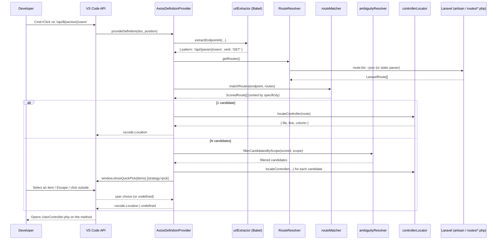
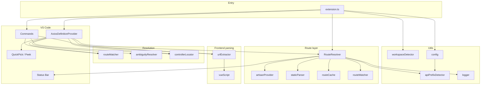

# Laravel-Vue Navigator — Technical Overview

Open-source technical documentation describing **how the VS Code/Cursor extension Laravel-Vue Navigator was designed and implemented**: goals, architecture, end-to-end data flow, design decisions, and known limitations.

**Extension version:** `0.1.2`  
**Stack:** TypeScript, VS Code Extension API, Babel Parser, php-parser (fallback), esbuild (bundle), Vitest (unit tests)

> **Revision note:** This document covers the **ambiguity-handling pipeline** introduced after the initial v0.1.0 release: when an axios URL contains a runtime expression (`${...}`) and multiple Laravel routes can match, the extension shows a non-invasive `QuickPick` instead of silently picking one. Sections 5, 8, 9 (new), 10.2, 12, 13, 15, and 17 have been updated accordingly.

---

## 1. Problem and goal

In **Laravel (API/backend) + Vue (frontend)** monorepos, the link between an HTTP call in the frontend and the PHP controller is invisible to the IDE: standard "Go to Definition" does not cross the language/project boundary.

The extension implements a VS Code **`DefinitionProvider`**: when the user **Cmd+Clicks** (macOS) or **Ctrl+Clicks** on a URL inside an `axios` call (or equivalent wrapper) in a `.vue`, `.ts`, or `.js` file, the editor opens the **Laravel controller** file and positions the cursor on the **method signature** that handles that route.

It does not run application code, start servers, or analyze runtime behavior: it is a **static navigator** based on JavaScript/TypeScript AST, Laravel route lists, and PSR-4 file resolution.

---

## 2. High-level view (pipeline)



In short: **endpoint extraction → route cache → URI/verb match (all candidates) → optional UI disambiguation → PHP file resolution → regex on the method**.

---

## 3. Repository structure

```
src/
├── extension.ts                 # Entry point: activate, wiring, commands
├── providers/
│   └── axiosDefinitionProvider.ts   # Implements vscode.DefinitionProvider
├── services/
│   ├── axiosParser/
│   │   ├── urlExtractor.ts      # Babel AST: finds axios.* at cursor
│   │   └── vueScript.ts         # Extracts <script> from .vue files
│   ├── routeResolver/
│   │   ├── index.ts             # RouteResolver (orchestrates cache + refresh)
│   │   ├── artisanProvider.ts   # spawn php artisan route:list --json
│   │   ├── staticParser.ts      # PHP route parser (fallback)
│   │   ├── routeCache.ts        # In-memory + disk cache
│   │   └── routeWatcher.ts      # File watcher with debounce
│   ├── routeMatcher.ts          # Client pattern vs Laravel URI (matchRoute + matchRoutes)
│   ├── ambiguityResolver.ts     # Scope filters + QuickPick item formatting (pure logic)
│   └── controllerLocator.ts     # PSR-4 + method line lookup
├── models/
│   └── route.ts                 # Shared types (LaravelRoute, ExtractedEndpoint, …)
└── utils/
    ├── config.ts                # VS Code settings reader
    ├── apiPrefixDetector.ts     # Auto-detect API prefix from bootstrap/app.php
    ├── workspaceDetector.ts     # Monorepo auto-detection
    ├── debounce.ts
    └── logger.ts                # Output channel "Laravel-Vue Navigator"
```

The published bundle is `dist/extension.js` (esbuild, Node target for the Extension Host).

---

## 4. Extension lifecycle (`extension.ts`)

### 4.1 Activation events

In `package.json`, the extension activates when:

- a `vue`, `typescript`, `javascript`, `typescriptreact`, or `javascriptreact` file is opened, **or**
- the workspace contains a `**/artisan` file.

### 4.2 `activate(context)`

1. **Workspace root** — If no workspace folder is open, the extension stays idle (logs to the output channel).
2. **Path detection** — `detectPaths()` finds the Laravel root (`artisan`) and optionally the frontend (`package.json` with a `vue` / `nuxt` / `@vue/runtime-core` dependency), up to **depth 3**, skipping `node_modules`, `vendor`, etc.
3. If `artisan` is **not** found, the extension does not register the provider (the user must set `laravelVueNavigator.laravelPath`).
4. **`RouteResolver`** — Started with config options; performs an initial `refresh(true)`; added to `context.subscriptions` for dispose.
5. **`AxiosDefinitionProvider`** — Registered via `vscode.languages.registerDefinitionProvider` for supported languages (file: scheme only).
6. **Commands:**
   - `laravelVueNavigator.refreshRoutes` — manual refresh + Composer cache invalidation.
   - `laravelVueNavigator.showRouteForEndpoint` — debug: shows the matched route in a notification without opening the file.
7. **`onConfigChange`** — When `laravelVueNavigator` settings change, recalculates paths, updates resolver options, and refreshes routes.

### 4.3 `deactivate()`

Calls `resolver.dispose()` (watcher + status bar).

---

## 5. "Go to Definition" flow (core product)

Implemented in `AxiosDefinitionProvider.provideDefinition()`:

| Step | Module | Input | Output |
|------|--------|-------|--------|
| 1 | `extractEndpointAt` | file source, language, cursor position | `{ pattern: string, verb?: HttpMethod }` or `undefined` |
| 2 | `RouteResolver.getRoutes()` | — | `LaravelRoute[]` (from cache or refresh) |
| 3 | `matchRoutes` | endpoint + routes + `apiBaseUrl` | `ScoredRoute[]` sorted by decreasing specificity |
| 4a (1 match) | `locateController` | route + `laravelRoot` | `{ file, line, column }` → `Location` |
| 4b (N matches) | `filterCandidatesByScope` + `locateController` | scored + `ambiguityScope` | Set of eligible candidates (with resolved PHP file) |
| 5 (N matches) | configured strategy | candidates | `Location` (`pick`/`first`) or `LocationLink[]` (`peek`) |
| 6 | VS Code | `Location` / `LocationLink[]` | Opens the PHP file at the `function` line, or shows the Peek panel |

If any step fails, the provider returns `undefined` and VS Code does not navigate (standard behavior).

**Cancellation:** after each `await`, `token.isCancellationRequested` is checked to avoid wasted work if the user has already moved the cursor. The same cancellation is propagated to the `QuickPick` via an internal `CancellationTokenSource`, so if VS Code cancels the operation (editor switch, new Cmd+Click, etc.) the popup closes automatically.

---

## 6. Endpoint extraction from the frontend (Babel)

**Files:** `src/services/axiosParser/urlExtractor.ts`, `vueScript.ts`

### 6.1 Vue files

`.vue` files are not parsed in full: `findContainingScript()` locates the `<script>` block containing the cursor line (supports `<script lang="ts">`), computes **line/column offset**, and passes only the script content to Babel.

### 6.2 AST parsing

- Parser: `@babel/parser` with `typescript` or JS plugins, plus `jsx` and `decorators-legacy`.
- `errorRecovery: true` — partially invalid files can still yield a useful AST.
- `CallExpression` nodes are traversed; the one that **geometrically contains** the cursor position (`node.loc`) is selected.
- The click must land on the **URL argument** (first argument or `url` property in the options object), not on `axios` or the request body.

### 6.3 Recognized patterns

| Code pattern | Example | Extracted `pattern` | `verb` |
|--------------|---------|----------------------|--------|
| HTTP method on client | `axios.get('/api/users')` | `/api/users` | `GET` |
| Template literal | `` axios.post(`/users/${id}`) `` | `/users/{param}` | `POST` |
| Options object | `axios({ method: 'patch', url: '...' })` | URL from `url` | from `method` |
| Wrapper | `api.delete('/sessions')` | as above | `DELETE` |

**Recognized HTTP clients** (regex on identifiers): `axios`, `http`, `api`, `client`, `instance`, `$http`, `$api`, also on chains like `this.$http` (partial: `this` alone is not enough).

**Not supported (by design):** URLs in variables or constants (`const u = '/x'; axios.get(u)`), because that would require data-flow analysis.

### 6.4 URL normalization in the pattern

- String literals → direct value.
- Template literals → static segments + `{param}` for each `${...}`.
- `+` concatenation between string literals → pattern concatenation.
- TypeScript casts (`as`, `!`) → unwrap on the inner expression.

---

## 7. Laravel route resolution (`RouteResolver`)

**File:** `src/services/routeResolver/index.ts`

Responsibilities: maintain an up-to-date list of `LaravelRoute`, manage **cache**, **watcher**, **status bar**, and **stale-on-error** strategy.

### 7.1 `LaravelRoute` data model

```typescript
interface LaravelRoute {
  methods: HttpMethod[];      // e.g. ['GET','HEAD'] — HEAD often filtered by artisan
  uri: string;                // e.g. '/api/users/{id}'
  name?: string;
  action: string;             // full string from artisan
  controller?: string;        // FQCN, e.g. App\Http\Controllers\UserController
  controllerMethod?: string;  // e.g. show
  middleware?: string[];
}
```

### 7.2 Hybrid strategy: Artisan (primary) → Static parser (fallback) → Stale cache

```
useArtisan === true?
    ├─ YES → php artisan route:list --json
    │         ├─ OK → cache write (source: artisan)
    │         └─ ERROR → fallback static parser
    └─ NO → static parser only

static parser
    ├─ OK (routes.length > 0) → cache write (source: static)
    └─ ERROR or 0 routes → useStale()
            ├─ previous in-memory cache
            ├─ or .vscode/laravel-vue-navigator.cache.json file (TTL ignored)
            └─ otherwise [] and status "no routes"
```

**Why Artisan:** resolves routes registered at runtime (ServiceProvider, macros, complex `Route::group`, middleware, prefixes applied by Laravel) — output matches what the app sees.

**Why static parser:** environments without PHP, IDE CI, or `artisan` failures (temporary syntax errors in the project).

### 7.3 `artisanProvider.ts`

- `spawn(phpBinary, ['artisan', 'route:list', '--json'], { cwd: laravelRoot })`
- Default timeout **15 seconds**; `SIGKILL` on expiry.
- Parse JSON array; each entry mapped with `splitAction` on `Controller@method` or invokable without `@`.
- `Closure` → route without `controller` (the provider will not navigate).

### 7.4 `staticParser.ts`

- Library: **`php-parser`** (PHP 8 AST).
- Default files analyzed: `routes/api.php`, `web.php`, `console.php`, `channels.php`.
- Recognizes `Route::get(...)` chains, `Route::prefix()->middleware()->group(...)`, `Route::resource`, `Route::apiResource`, redirects, action arrays `[UserController::class, 'index']`, and strings `'App\Http\Controllers\UserController@show'`.
- **Limits vs Artisan:** does not execute PHP; routes defined only in custom ServiceProviders or with complex conditional logic may be missing.

The static parser also receives an **`apiRoutePrefix`** derived from `detectApiRoutePrefix()` so routes in `routes/api.php` are prefixed consistently with Laravel's bootstrap configuration (see section 11.2).

### 7.5 Cache (`routeCache.ts`)

- Path: **`.vscode/laravel-vue-navigator.cache.json`** at the workspace root.
- Payload version `1`: `generatedAt`, `source`, `routes[]`.
- Configurable TTL (`routeCacheTtl`, default 3600s) — safety net; in normal use the **file watcher** invalidates earlier.
- Disk write is best-effort: on failure, the in-memory copy remains.

### 7.6 File watcher (`routeWatcher.ts`)

Observed patterns (relative to `laravelRoot`):

- `routes/**/*.php`
- `app/Http/Controllers/**/*.php`
- `app/Providers/**/*.php`

On create/change/delete → **debounce** (`refreshDebounceMs`, default 500ms) → `RouteResolver.refresh(true)`.

*Note:* controller-only changes do not change the URI, but refactors can change namespace/class names; the refresh is conservative.

### 7.7 Status bar

Right-side item with states: `ready` | `refreshing` | `N routes (artisan|static)` | `stale (N)` | `no routes`. Click → refresh command.

---

## 8. Endpoint ↔ route matching (`routeMatcher.ts`)

### 8.1 Path variants

From a client `pattern` (e.g. `/users/42/posts`), candidates are generated:

- path as-is;
- with `apiBaseUrl` prefix if configured (e.g. `/api` + `/users` → `/api/users`);
- leading slash normalized.

### 8.2 Segment normalization

- Query string removed (`?foo=bar`).
- Trailing slash removed (except root `/`).
- Segments `{id}`, `{param}` (from JS templates) treated as **parametric wildcards**.

### 8.3 Comparison and specificity

For each Laravel route, `uri` is normalized to the same segment format and literal/param compatibility is verified.

Specificity score: literal segments count **2**, parameters count **1** (prefers `/users/{id}` over a catch-all `{any}`).

### 8.4 HTTP verb

If `verb` is known (from `axios.get`, etc.), routes that do not accept that method are filtered (`ANY` accepts all).

If no match with the verb, retry **without verb filter** (useful for malformed `axios({ url, method })` or edge cases).

### 8.5 Exposed API: `matchRoute` vs `matchRoutes`

The module exposes **two functions**:

| Function | Returns | Use |
|----------|---------|-----|
| `matchRoute(endpoint, routes, opts)` | `LaravelRoute \| undefined` | Convenient for batch calls (e.g. "Show route for endpoint" command). Wrapper over `matchRoutes()[0]?.route`. |
| `matchRoutes(endpoint, routes, opts)` | `ScoredRoute[]` sorted by `score` desc | Core of the provider: recognizes and handles ambiguity (multiple candidates). Deduplicates by `LaravelRoute` when multiple normalized variants match the same route. |

When the client pattern contains `{param}` (template literal) **and** multiple Laravel routes have literal segments compatible with that position, `matchRoutes` returns **all** candidates, leaving UI/strategy choice to the provider.

---

## 9. Disambiguation (`ambiguityResolver.ts` + provider)

### 9.1 Why it exists

Real-world example:

```ts
let section = 'template';
axios.get(`/api/${section}/users`);
```

The extracted pattern is `/api/{param}/users`. If Laravel has both `GET /api/template/users` and `GET /api/route_book/users`, both have the same specificity (3 literal segments in route → score 6) and **before v0.1.x the provider silently picked the first**. Ambiguous behavior dependent on route registration order.

### 9.2 Disambiguation pipeline

```
matchRoutes() → ScoredRoute[]
        │
        │  N == 0 → undefined (no definition)
        │  N == 1 → direct jump
        │  N >  1 ↓
        ▼
filterCandidatesByScope(scored, ambiguityScope)
        ├─ 'topScoreOnly' → only candidates with the top score (default)
        └─ 'allMatches'   → all matches, including less specific fallbacks
        │
        │  Resolves PHP files via locateController for each candidate
        │  (unresolvable ones are discarded)
        │
        ▼
ambiguityStrategy
        ├─ 'pick'  → vscode.window.showQuickPick(items)  [default]
        ├─ 'peek'  → return LocationLink[] (VS Code opens native Peek)
        └─ 'first' → return Location of first candidate (legacy behavior)
```

### 9.3 `ambiguityResolver.ts` module

**Pure logic** (zero `vscode` dependencies) → fully unit-tested.

| API | Role |
|-----|------|
| `filterCandidatesByScope(scored, scope)` | Implements scope rule (`topScoreOnly` keeps only the top-score tier; `allMatches` keeps everything). |
| `formatQuickPickEntry(candidate, laravelRoot)` | Builds `{ label, description, detail }` for a single `QuickPick` item: `label = "GET /api/template/users"`, `description = action FQCN`, `detail = PHP file path relative to Laravel root`. |

### 9.4 `QuickPick` (`pick`)

Implemented in `AxiosDefinitionProvider.promptUserToPick()`:

- `vscode.window.showQuickPick(items, options, cancelToken)`.
- `placeHolder`: `"Multiple Laravel routes match this endpoint — pick one (N)"`.
- `title`: `"Laravel-Vue Navigator: choose a route"`.
- `matchOnDescription` and `matchOnDetail` enabled (incremental filter).
- `ignoreFocusOut: false` → popup closes on click outside, editor switch, etc.
- The provider's `CancellationToken` is linked to a local `CancellationTokenSource` to close the `QuickPick` if VS Code cancels the definition request.
- `await showQuickPick` returns inside the same `provideDefinition`, so VS Code navigates *as if* it found a single definition: no flicker, no separate commands.

### 9.5 `Peek` (`peek`)

In `peek` mode, the provider returns a `LocationLink[]` array directly: VS Code opens its native Peek panel inline. Pro: zero custom UI. Con: Peek shows file path + snippet, **not** the route URI, so it is less informative than `QuickPick` when multiple routes point to the same controller.

### 9.6 `First` (`first`)

Legacy behavior: the first candidate ordered by score wins, with no prompt. Useful for users who prefer uninterrupted flow and trust the best match.

### 9.7 Logging

When ambiguity is detected, the provider logs a line to the output channel:

```
[<timestamp>] Ambiguous endpoint '/api/{param}/users' (GET): 2 candidate routes -> strategy=pick
```

Useful for debugging in large monorepos.

---

## 10. Controller localization (`controllerLocator.ts`)

### 10.1 From FQCN to file

1. Reads `composer.json` → **PSR-4** maps (`autoload` + `autoload-dev`), with in-memory cache per workspace.
2. Tries PSR-4 prefixes from longest to shortest.
3. Laravel convention fallback: `App\...` → `app/....php`.

### 10.2 From method to line/column

Textual read of the PHP file (no PHP AST for the method):

```regex
^\s*(public|protected|private)?\s*(static\s+)?function\s+<methodName>\s*\(
```

First occurrence → `Position` for VS Code (column on the `function` token). If the method does not exist, fallback to line 0.

`clearComposerCache()` is called on manual refresh and config change, to reflect `composer.json` updates.

---

## 11. Monorepo and configuration

### 11.1 Auto-detection (`workspaceDetector.ts`)

| Target | Marker | Max depth |
|--------|--------|-----------|
| Laravel | `artisan` file | 3 levels below workspace root |
| Frontend | `package.json` with `vue` / `nuxt` / `@vue/runtime-core` | 3 levels |

Ignored folders: `node_modules`, `vendor`, `.git`, `dist`, `build`, `storage`, `public`, etc.

The **frontend root** is detected and logged today but **does not** limit where the DefinitionProvider works: all `vue/ts/js` files in the workspace with `file:` scheme are eligible.

### 11.2 Settings (`laravelVueNavigator.*`)

| Setting | Default | Role |
|---------|---------|------|
| `laravelPath` | `auto` | Path relative to workspace root with `artisan`, or `auto` |
| `frontendPath` | `auto` | Informational / future use; `auto` |
| `apiBaseUrl` | `""` | Prefix for axios URLs without a leading `/` or without the API prefix |
| `phpBinary` | `php` | PHP executable for artisan |
| `useArtisan` | `true` | `false` = static parser only |
| `routeCacheTtl` | `3600` | Disk cache TTL (seconds) |
| `refreshDebounceMs` | `500` | Watcher debounce (ms) |
| `ambiguityStrategy` | `pick` | Response to >1 match: `pick` (QuickPick), `peek` (native Peek), `first` (silent best-match) |
| `ambiguityScope` | `topScoreOnly` | Subset to show: `topScoreOnly` (top-score ties only) or `allMatches` (including less specific fallbacks). Ignored with `ambiguityStrategy: first` |

**`apiBaseUrl` auto-detection:** When `apiBaseUrl` is left empty (the default), the extension uses `effectiveApiBaseUrl()` in `config.ts`, which calls `detectApiRoutePrefix()` from `apiPrefixDetector.ts`. That module reads `bootstrap/app.php` and looks for Laravel 11+ `apiPrefix: '...'` or a `Route::prefix('...')->group(base_path('routes/api.php'))` pattern. If nothing is found, it falls back to `/api`. A non-empty `apiBaseUrl` setting always wins over auto-detection. This keeps route matching aligned with how Laravel prefixes API routes without requiring manual configuration in typical setups.

The last two config values are validated at runtime by `coerceEnum`: strings outside the enum are silently reset to the default to avoid regressions from typos in `settings.json`.

---

## 12. VS Code API integration (key points)

| API | Use |
|-----|-----|
| `languages.registerDefinitionProvider` | Cmd+Click → `provideDefinition` |
| `workspace.createFileSystemWatcher` | Route refresh on save |
| `window.createStatusBarItem` | Cache status feedback |
| `commands.registerCommand` | Refresh and debug |
| `workspace.getConfiguration` | Settings |
| `window.createOutputChannel` | Diagnostic logs |
| `window.showQuickPick` | Disambiguation `ambiguityStrategy: pick` |
| `CancellationTokenSource` | Auto-close QuickPick on VS Code cancellation |
| `LocationLink[]` returned from `provideDefinition` | Disambiguation `ambiguityStrategy: peek` (native Peek panel) |

The extension **does not** use the Language Server Protocol (LSP): it is a lightweight provider with no separate process.

---

## 13. Build, test, and distribution

| Command | Effect |
|---------|--------|
| `npm run build` | esbuild → `dist/extension.js` |
| `npm run watch` | continuous rebuild for F5 |
| `npm test` | Vitest: urlExtractor, routeMatcher (+ `matchRoutes`), ambiguityResolver, staticParser, controllerLocator, apiPrefixDetector, debounce, artisan (mock) |
| `npm run package` | `.vsix` for local installation |
| F5 in repo | Extension Development Host |

Unit tests **do not** start VS Code: they cover pure modules. E2E testing is manual on a real monorepo with a working `artisan`.

**Tests introduced for disambiguation:**

- `routeMatcher.test.ts` — `matchRoutes` with literal-vs-literal scenario (ambiguous routes at same specificity), less specific `{any}` fallback, no-match, dedup when multiple normalized variants point to the same route.
- `ambiguityResolver.test.ts` — scope filters, item formatting (label/description/detail), empty `methods` handling (`ANY`), paths outside Laravel root.

The VS Code-dependent part (`showQuickPick`, `CancellationTokenSource`) is **not** covered by unit tests because it would require mocking the `vscode` module; it is exercised manually in the Extension Development Host (F5).

---

## 14. Deliberate limitations (excluded from v0.1 roadmap)

Documented in the README and consistent with the code:

- Fully non-literal URLs (e.g. `const URL = '/users'; axios.get(URL)`). **Template literals with `${var}` are supported** and disambiguated via QuickPick.
- **axios**-style clients / wrappers with conventional names only — no `fetch`, `ofetch`, `ky`.
- **Closure** routes without a controller → no destination.
- Static parser incomplete vs dynamic PHP routes.
- No reverse navigation (PHP → Vue calls).
- No CodeLens / Hover / route autocomplete.

---

## 15. Concrete end-to-end example

### 15.1 Simple case (single match)

**Frontend** (`resources/js/pages/Users.vue`):

```vue
<script setup lang="ts">
import axios from 'axios';
const load = () => axios.get('/api/users');
</script>
```

**Backend** (`routes/api.php`):

```php
Route::get('/users', [UserController::class, 'index']);
```

**Sequence:**

1. Click on `'/api/users'` → Babel finds `CallExpression` `axios.get`, pattern `/api/users`, verb `GET`.
2. `getRoutes()` returns routes from artisan with `uri: api/users` or `/api/users` (normalized), `controller: App\Http\Controllers\UserController`, `controllerMethod: index`.
3. `matchRoutes` aligns segments and verb and returns a single `ScoredRoute`.
4. Provider goes directly to `locateController` (skips ambiguity pipeline).
5. `locateController` resolves `app/Http/Controllers/UserController.php`, regex finds `public function index(`.
6. VS Code opens the file at the `function` line.

### 15.2 Ambiguous case (template literal with variable)

**Frontend**:

```vue
<script setup lang="ts">
import axios from 'axios';
const section = ref<'template' | 'route_book'>('template');
const load = () => axios.get(`/api/${section.value}/users`);
</script>
```

**Backend** (two routes sharing the same structural pattern):

```php
Route::get('/template/users',   [Template\UserController::class, 'index']);
Route::get('/route_book/users', [RouteBook\UserController::class, 'index']);
```

**Sequence:**

1. Click on the URL → extracted pattern `/api/{param}/users`, verb `GET`.
2. `matchRoutes` produces two `ScoredRoute` entries with equal score (6).
3. `filterCandidatesByScope(_, 'topScoreOnly')` (default) keeps both.
4. `locateController` resolves both PHP files; unresolvable ones would be discarded.
5. Default strategy `pick` → `vscode.window.showQuickPick` with two items:
   - `GET /api/template/users` — `App\Http\Controllers\Template\UserController@index` — `app/Http/Controllers/Template/UserController.php`
   - `GET /api/route_book/users` — `App\Http\Controllers\RouteBook\UserController@index` — `app/Http/Controllers/RouteBook/UserController.php`
6. User selects with arrows + Enter or mouse → `provideDefinition` returns the corresponding `Location` → VS Code opens the correct file.
7. If the user presses `Escape` or clicks outside, the popup closes and nothing happens (no navigation, no error).

---

## 16. Module diagram (dependencies)



---

## 17. Key takeaways

1. **Not magic:** it is a deterministic chain AST → route list → match → (optional disambiguation) → file path.
2. **Production reliability:** Artisan as source of truth; fallback and stale cache avoid breaking navigation while saving PHP with errors.
3. **No more silent wrong jumps:** when the URL contains `${var}`, the provider shows a QuickPick with all compatible routes (full URI + controller + file) — the user chooses explicitly, and we never navigate to a "wrong but plausible" destination. Configurable via `ambiguityStrategy`/`ambiguityScope` for legacy behavior or native Peek.
4. **Built for monorepos:** automatic `artisan` scan and explicit settings when the layout is non-standard.
5. **Extensible:** new HTTP clients or URLs from variables require new modules (analyzer / LSP), not a patch to the matcher.
6. **Quality:** Vitest unit tests on critical pieces (run `npm test`); output channel and "Show route for endpoint" command for quick debugging.

---

## 18. Quick code references

| Concept | Primary file |
|---------|--------------|
| Provider registration | `src/extension.ts` |
| Cmd+Click handler | `src/providers/axiosDefinitionProvider.ts` |
| Axios parsing | `src/services/axiosParser/urlExtractor.ts` |
| Vue script | `src/services/axiosParser/vueScript.ts` |
| Cache + refresh | `src/services/routeResolver/index.ts` |
| Artisan | `src/services/routeResolver/artisanProvider.ts` |
| PHP route parser | `src/services/routeResolver/staticParser.ts` |
| URI match (single + plural) | `src/services/routeMatcher.ts` |
| Ambiguity filters + QuickPick items | `src/services/ambiguityResolver.ts` |
| Controller file | `src/services/controllerLocator.ts` |
| Settings + enum validation | `src/utils/config.ts` |
| API prefix auto-detection | `src/utils/apiPrefixDetector.ts` |
| Monorepo detection | `src/utils/workspaceDetector.ts` |

---

*Open-source technical documentation for Laravel-Vue Navigator. For user setup, configuration, and quick commands, see the [README](../README.md) in the project root.*
