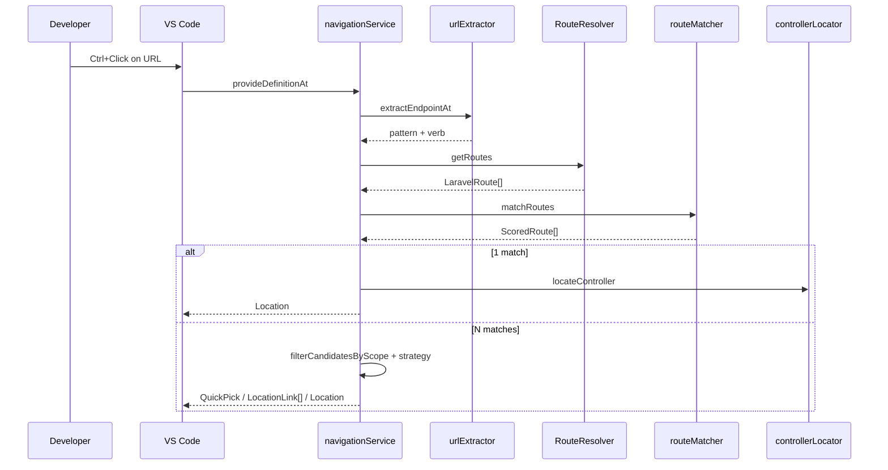

# Laravel-Vue Navigator — Technical Overview

How the extension works internally. For setup and usage see [README](../README.md).

**Version:** `0.1.6` · TypeScript · VS Code Extension API · Babel · php-parser · esbuild · Vitest

---

## Goal

Static navigator: **frontend axios URL → Laravel controller method**. No servers, no runtime analysis — AST extraction, route list, URI matching, PSR-4 file resolution.

Two entry points:

| Gesture | VS Code API | Handler |
|---------|-------------|---------|
| Ctrl/Cmd+Click (Go to Definition) | `DefinitionProvider` | `AxiosDefinitionProvider` → `navigationService.provideDefinitionAt` |
| Click underlined URL | `DocumentLinkProvider` | `AxiosDocumentLinkProvider` → command `goToController` → `navigationService.navigateAtPosition` |

---

## Pipeline

```
.vue / .ts / .js
  → urlExtractor (Babel AST)     { pattern, verb? }
  → RouteResolver.getRoutes()    LaravelRoute[]  (artisan → static → stale)
  → routeMatcher.matchRoutes()   ScoredRoute[]   (sorted by specificity)
  → ambiguity filter + strategy  0 / 1 / N matches
  → controllerLocator            { file, line, column }
  → VS Code opens PHP at method signature
```

<details>
<summary><strong>Sequence diagram</strong></summary>



</details>

---

## Source layout

```
src/
├── extension.ts                          # activate, wiring, commands
├── providers/
│   ├── axiosDefinitionProvider.ts      # thin DefinitionProvider wrapper
│   └── axiosDocumentLinkProvider.ts      # underlined URLs → goToController
├── services/
│   ├── navigationService.ts            # core: provideDefinitionAt, navigateAtPosition, QuickPick
│   ├── axiosParser/
│   │   ├── urlExtractor.ts               # Babel: axios calls at cursor
│   │   └── vueScript.ts                  # <script> block extraction from .vue
│   ├── routeResolver/
│   │   ├── index.ts                      # RouteResolver orchestrator
│   │   ├── artisanProvider.ts            # php artisan route:list --json
│   │   ├── staticParser.ts               # php-parser fallback
│   │   ├── routeCache.ts                 # memory + .vscode/*.cache.json
│   │   └── routeWatcher.ts               # debounced FS watcher
│   ├── routeMatcher.ts                   # matchRoute / matchRoutes
│   ├── ambiguityResolver.ts              # scope filter + QuickPick labels (pure)
│   └── controllerLocator.ts              # PSR-4 + method line regex
├── models/route.ts
└── utils/                                # config, workspaceDetector, apiPrefixDetector, debounce, logger
```

Published bundle: `dist/extension.js` (esbuild).

---

## Module reference

### Activation (`extension.ts`)

Activates on `vue` / `ts` / `js` / `tsx` / `jsx` files, or `workspaceContains:**/artisan`.

1. `detectPaths()` — Laravel root (`artisan`) + frontend (`vue` / `nuxt` / `@vue/runtime-core` in `package.json`), depth ≤ 3.
2. No `artisan` → warning, extension idle (set `laravelPath`).
3. `RouteResolver.start()` + initial refresh.
4. Register DefinitionProvider, DocumentLinkProvider, commands.

**Commands:** `refreshRoutes`, `showRouteForEndpoint`, `goToController`.

### Endpoint extraction (`urlExtractor.ts`)

- **Vue:** only the `<script>` block containing the cursor (`vueScript.ts`).
- **Babel:** `CallExpression` containing cursor; URL must be on the URL arg (not on `axios` / `params`).
- **Patterns:** literals, template literals (`${x}` → `{param}`), `+` concat, TS casts unwrap, object form `{ method, url }`.
- **Clients:** `axios`, `api`, `http`, `client`, `instance`, `$http`, `$api`, chained (`this.$http`, etc.).
- **Not supported:** URL held in a variable (`axios.get(url)`).

### Route resolution (`RouteResolver`)

```
useArtisan? → artisan route:list --json → cache (artisan)
           └ fail → static parser → cache (static)
                        └ fail/empty → stale cache → else no routes
```

| Piece | Detail |
|-------|--------|
| Artisan | `spawn(php, ['artisan','route:list','--json'])`, 15s timeout, maps `Controller@method` |
| Static | `php-parser` on `routes/{api,web,console,channels}.php`; prefix via `detectApiRoutePrefix()` |
| Cache | `.vscode/laravel-vue-navigator.cache.json`, TTL `routeCacheTtl` (watcher refreshes sooner) |
| Watcher | `routes/**`, `app/Http/Controllers/**`, `app/Providers/**` — debounce `refreshDebounceMs` |
| Status bar | `LVN: N routes (artisan\|static)` · `stale (N)` · click = refresh |

`Closure` routes have no controller → no navigation.

### Matching (`routeMatcher.ts`)

- Builds URI variants with `effectiveApiBaseUrl()` (setting or auto from `bootstrap/app.php`, default `/api`).
- Segment match: literals vs `{param}` / `{id}`; score = 2× literals + 1× params.
- Verb filter when known; retry without verb if no hit.
- **`matchRoutes`** — all candidates, deduped, sorted. **`matchRoute`** — first only (debug command).

### Ambiguity (`navigationService` + `ambiguityResolver`)

When `matchRoutes` returns >1 candidate at same scope:

| `ambiguityScope` | Effect |
|------------------|--------|
| `topScoreOnly` | Only top specificity tier (default) |
| `allMatches` | Include looser fallbacks |

| `ambiguityStrategy` | `provideDefinitionAt` (Ctrl+Click) | `navigateAtPosition` (document link) |
|---------------------|-------------------------------------|--------------------------------------|
| `pick` | QuickPick → `openResolvedLocation` | QuickPick → open file |
| `peek` | `LocationLink[]` (native Peek) | First candidate only |
| `first` | Best match silently | Best match silently |

QuickPick: title *"Laravel-Vue Navigator: choose a route"*, cancellable (Escape / focus loss). Logs: `Ambiguous endpoint '…' (VERB): N candidate routes -> strategy=…`.

### Controller location (`controllerLocator.ts`)

1. `composer.json` PSR-4 maps (longest prefix first); fallback `App\` → `app/`.
2. Regex on PHP file: `function <methodName>(` → line/column.
3. `clearComposerCache()` on refresh / config change.

### Config (`config.ts`)

| Setting | Default | Role |
|---------|---------|------|
| `laravelPath` / `frontendPath` | `auto` | Monorepo roots |
| `apiBaseUrl` | `""` | Override API prefix; empty → `detectApiRoutePrefix()` |
| `phpBinary` | `php` | Artisan binary |
| `useArtisan` | `true` | `false` = static only |
| `routeCacheTtl` | `3600` | Disk cache TTL (s) |
| `refreshDebounceMs` | `500` | Watcher debounce |
| `ambiguityStrategy` | `pick` | `pick` · `peek` · `first` |
| `ambiguityScope` | `topScoreOnly` | `topScoreOnly` · `allMatches` |

Invalid enum values coerced to defaults via `coerceEnum`.

---

## Deliberate limits

- Variable URLs, `fetch` / `ofetch` / `ky`
- Closure-only routes
- Static parser misses dynamic-only registrations
- No reverse nav (PHP → Vue), hover, CodeLens
- `frontendPath` detected but not used to scope providers (all workspace `file:` vue/ts/js qualify)

---

## Build & test

| Command | Purpose |
|---------|---------|
| `npm run build` | esbuild → `dist/extension.js` |
| `npm test` | Vitest (pure modules, no VS Code host) |
| `npm run test:coverage` | Coverage thresholds on core services |
| F5 | Extension Development Host |

**Unit tests:** `urlExtractor`, `routeMatcher`, `ambiguityResolver`, `staticParser`, `controllerLocator`, `apiPrefixDetector`, `artisanProvider` (mock), `debounce`.

**Manual QA:** [QA_CHECKLIST.md](./QA_CHECKLIST.md) on a real monorepo (QuickPick, watcher, stale cache, settings).

---

## Quick file index

| Concern | File |
|---------|------|
| Entry + commands | `src/extension.ts` |
| Navigation core | `src/services/navigationService.ts` |
| Ctrl+Click wrapper | `src/providers/axiosDefinitionProvider.ts` |
| Document links | `src/providers/axiosDocumentLinkProvider.ts` |
| Axios AST | `src/services/axiosParser/urlExtractor.ts` |
| Route cache | `src/services/routeResolver/index.ts` |
| URI matching | `src/services/routeMatcher.ts` |
| Ambiguity labels | `src/services/ambiguityResolver.ts` |
| Controller file | `src/services/controllerLocator.ts` |
